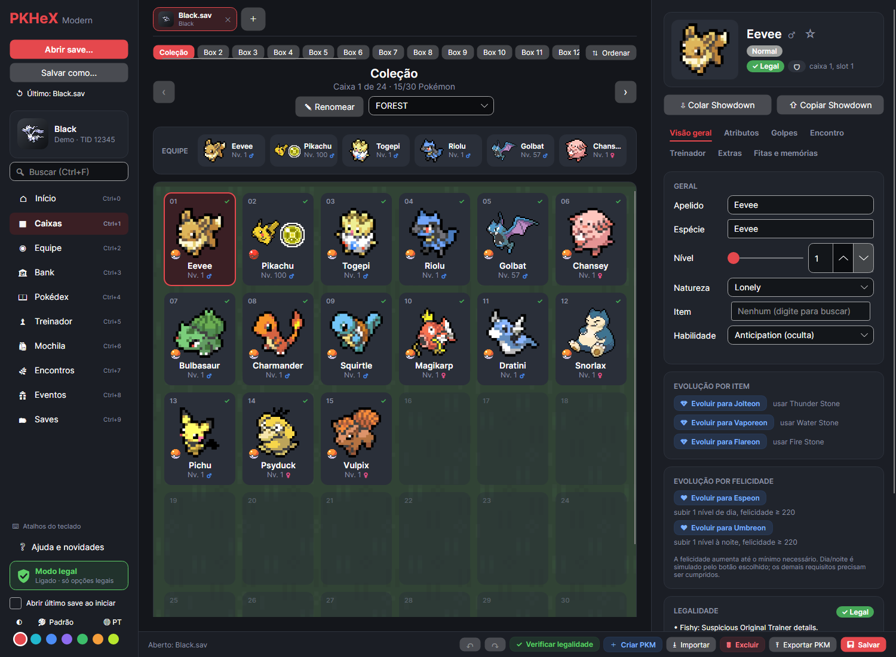
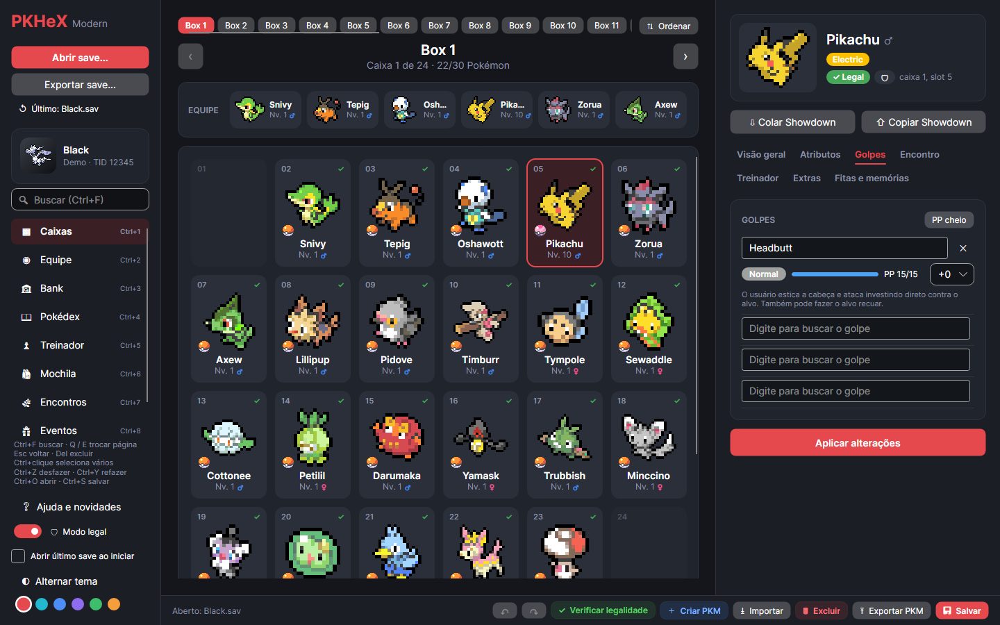
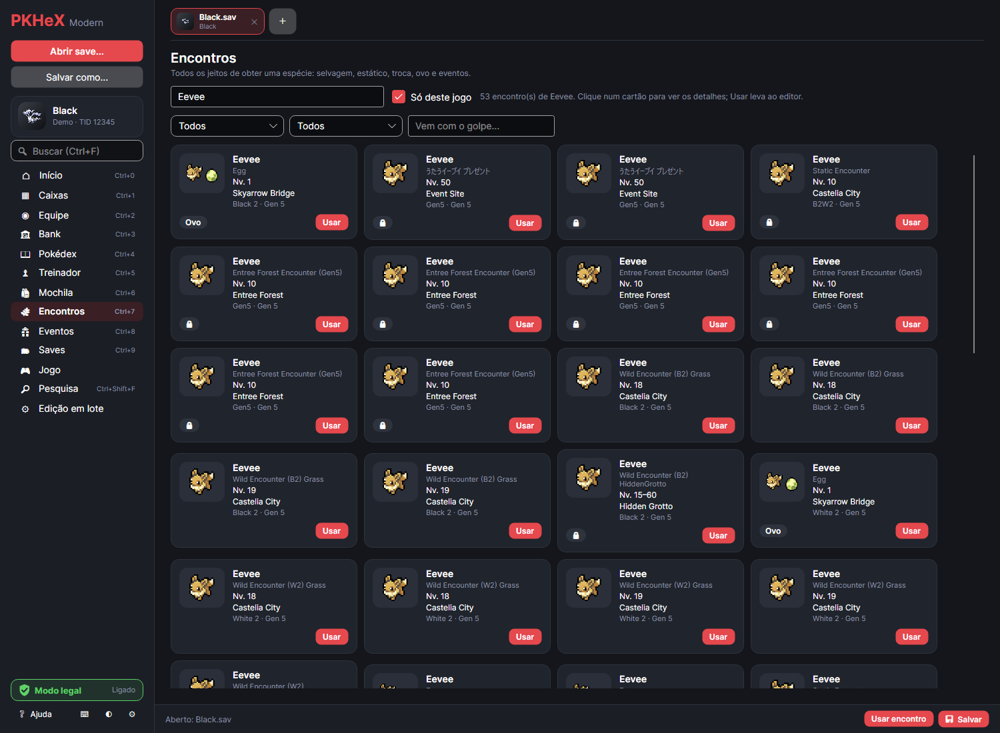
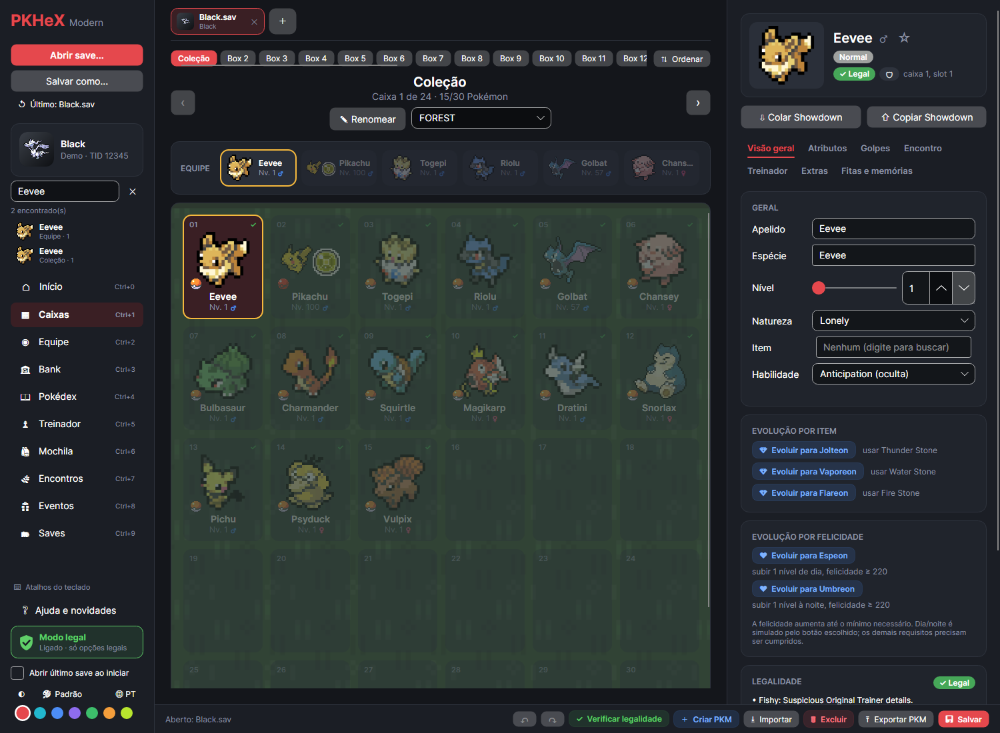
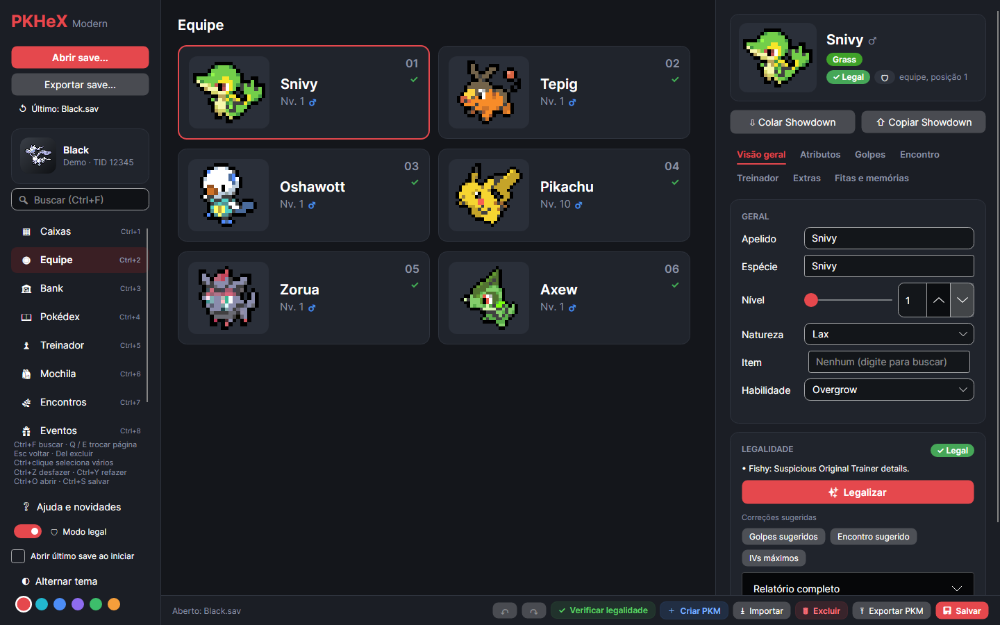

# PKHeX Modern

Interface alternativa para o [PKHeX](https://github.com/kwsch/PKHeX), feita em **Avalonia + Fluent**, com tema escuro e claro e interface em português.
Ela é construída **por cima** do `PKHeX.Core`, sem alterar os projetos originais: as regras de save, legalidade e encontros são as mesmas do PKHeX, e as atualizações do PKHeX oficial entram por merge sem conflitos.



| Golpes com busca (verde = aprende) | Banco de encontros |
|---|---|
|  |  |
| **Busca global (Ctrl+F)** | **Equipe** |
|  |  |

## Download

Baixe o `PKHeX.Modern-win-x64.zip` na página de [Releases](https://github.com/carlosmozart/PKHeX/releases), extraia e abra o `PKHeX.Modern.exe`.
É um único executável para Windows 10/11 (64 bits) e **não precisa do .NET instalado**. Na primeira execução ele demora alguns segundos a mais, porque extrai as bibliotecas nativas.

> O Windows pode mostrar o aviso do SmartScreen, porque o executável não é assinado. Clique em "Mais informações" e "Executar assim mesmo".

## Funcionalidades

**Saves**
- Abrir pelo botão, arrastando o arquivo para a janela ou pela linha de comando; salvar com **Ctrl+S**.
- **Save Manager**: tela inicial que lista os saves da pasta `saves` (ao lado do exe, ou outra à sua escolha), agrupados por console, com treinador, tempo de jogo, dinheiro e equipe. Duplo clique abre.
- Aviso de **alterações não exportadas**: o app pergunta antes de abrir outro save ou fechar.
- **Backup automático**: antes de salvar por cima de um save, o arquivo anterior é copiado para `%APPDATA%\PKHeX.Modern\backups` (botão "Backups" no Save Manager).

**Bank local**
- Armazenamento próprio, fora dos saves, em **bancos → caixas** (crie, renomeie e exclua). Os Pokémon ficam como arquivos `.pk*` em `%APPDATA%\PKHeX.Modern\bank`, no formato original.
- Página **Bank** com duas telas lado a lado: bank à esquerda e o save aberto à direita. Arraste para guardar ou trazer (Ctrl/Shift copia, Alt sobrescreve).
- Ao trazer para o save, o Pokémon é **convertido para a geração do jogo** (ex.: um Pokémon da Gen 4 vai para Black como Gen 5); se não der, o app avisa e nada muda.

**Caixas e equipe**
- Cartões grandes com sprite, nome, nível, gênero, bola, ★ shiny e ✓/⚠ de legalidade; caixas em abas no topo.
- **Resumo ao passar o mouse**, igual ao do PKHeX: set (item, habilidade, IVs/EVs, natureza, golpes) e encontro (local, PID, Origin Seed).
- **Arrastar e soltar** entre caixa e equipe (Ctrl ou Shift copia, Alt sobrescreve deixando a origem vazia), trocar de caixa parando sobre as setas, soltar `.pk*` para importar e arrastar para fora da janela para exportar.
- **Busca global (Ctrl+F)** por espécie, apelido, golpe, item, "shiny" ou "ovo" em todas as caixas.
- **Seleção múltipla**: Ctrl+clique marca, Shift+clique marca um intervalo, Ctrl+A a caixa toda; arraste um marcado para mover o grupo (para outra caixa ou para o bank) ou use Delete para excluir todos.
- **Ordenar caixas** por Pokédex, nome, nível, shiny, tipo, IVs ou data de captura, só a caixa aberta ou todas (também no bank).
- **Desfazer/refazer** (Ctrl+Z / Ctrl+Y) e **Excluir** (Delete).

**Editor de Pokémon** (abas: Visão geral, Atributos, Golpes, Encontro, Treinador, Extras)
- Espécie, item e golpes com **busca enquanto digita**; na lista de golpes, os que o Pokémon aprende ficam no topo, em verde.
- Golpes com tipo colorido, barra de PP e PP Ups.
- Gráfico radar dos atributos, sliders de IV/EV e ▲/▼ da natureza.
- Bola, local, nível e data de encontro; treinador original; felicidade, PID/EC e "Tornar shiny".
- **Verificar legalidade** (barra inferior): confere o save inteiro e mostra o resultado numa janela.
- **Legalidade** no editor: lista os problemas e avisos e oferece correções de um clique, inclusive **Legalizar**, que gera o Pokémon de novo a partir de um encontro real do jogo (PID/IV corretos, inclusive shiny) mantendo natureza, nível, item, apelido e golpes.
- **Evoluir por troca** (Kadabra, Onix + Metal Coat, Shelmet/Karrablast...), sem precisar de um segundo jogo; da Gen 6 em diante registra o parceiro de troca para o Pokémon continuar legal.
- Colar e copiar no formato **Showdown**.

**Bancos**
- **Encontros**: todos os jeitos de obter uma espécie (selvagem, estático, troca, ovo, evento).
- **Eventos**: banco de Mystery Gift do PKHeX, com busca, inclusive os eventos da Gen 1-3.
- "Usar" gera o Pokémon no editor, pronto para gravar.

**Outros**
- Treinador (nome, TID/SID, dinheiro, tempo de jogo) e Mochila.
- Tema claro/escuro e **cor de destaque** configurável.
- Atalhos: Q/E trocam de página, Ctrl+1–7 vão direto, Esc volta, Ctrl+O abre.

As preferências ficam em `%APPDATA%\PKHeX.Modern\settings.json`. Se algo der errado, os detalhes ficam em `%APPDATA%\PKHeX.Modern\crash.log`.

Os nomes do jogo (espécies, golpes, itens) e os textos de legalidade ficam em inglês, como no PKHeX; só a interface é em português.

## Rodar a partir do código

Requisitos: Windows e [.NET SDK 10](https://dotnet.microsoft.com/download).

```bash
dotnet run --project PKHeX.Modern
dotnet run --project PKHeX.Modern -- "C:\caminho\para\save.sav"   # abre direto um save
```

Gerar o executável único:

```bash
dotnet publish PKHeX.Modern -p:PublishProfile=win-x64
```

A cada push no branch `modern-ui`, o GitHub Actions gera o executável (aba Actions). Uma tag `modern-v*` também cria a Release.

## Arquitetura

```
PKHeX.Core / PKHeX.Drawing.*   ← upstream, intocados
        │
Services/CoreAdapter.cs        ← ponto principal de contato com o Core
Services/EncounterDatabase.cs  ← bancos de encontros/eventos e Legalizar
Services/ShinyMethodH.cs       ← shiny da Gen 3 com sequência RNG do jogo
Services/SlotHistory.cs        ← desfazer/refazer
Services/SaveLibrary.cs        ← Save Manager
Services/EntitySearch.cs       ← busca global
Services/SpriteService.cs      ← sprites System.Drawing → Avalonia
Services/SaveBackup.cs         ← backup antes de sobrescrever um save
Services/AppSettings.cs, CrashLog.cs
        │
ViewModels/                    ← estado e lógica (Pages.cs = páginas da barra lateral)
Views/ + App.axaml             ← XAML; DataTemplates das páginas ficam em App.axaml
Theme/                         ← Palette.axaml (cores), Styles.axaml, AccentTheme.cs
```

## Atualizando com o PKHeX oficial

```bash
git fetch upstream
git merge upstream/master
dotnet build PKHeX.Modern
```

Fora de `PKHeX.Modern/`, `Tools/` e `.github/workflows/modern-build.yml`, o fork altera apenas uma linha no `PKHeX.slnx` e um bloco no `README.md` da raiz.
Se o build quebrar depois de um merge, o erro estará quase sempre em `Services/`.

## Capturas de tela automáticas

```bash
dotnet run --project Tools/PKHeX.Modern.Render -- "save.sav" "pasta_saida"
```

Renderiza a interface sem abrir janela (Avalonia headless), útil para conferir o layout.

Veja também: [ROADMAP.md](ROADMAP.md) (pendências) e [CONTINUAR.md](CONTINUAR.md) (contexto para continuar em outro PC).
