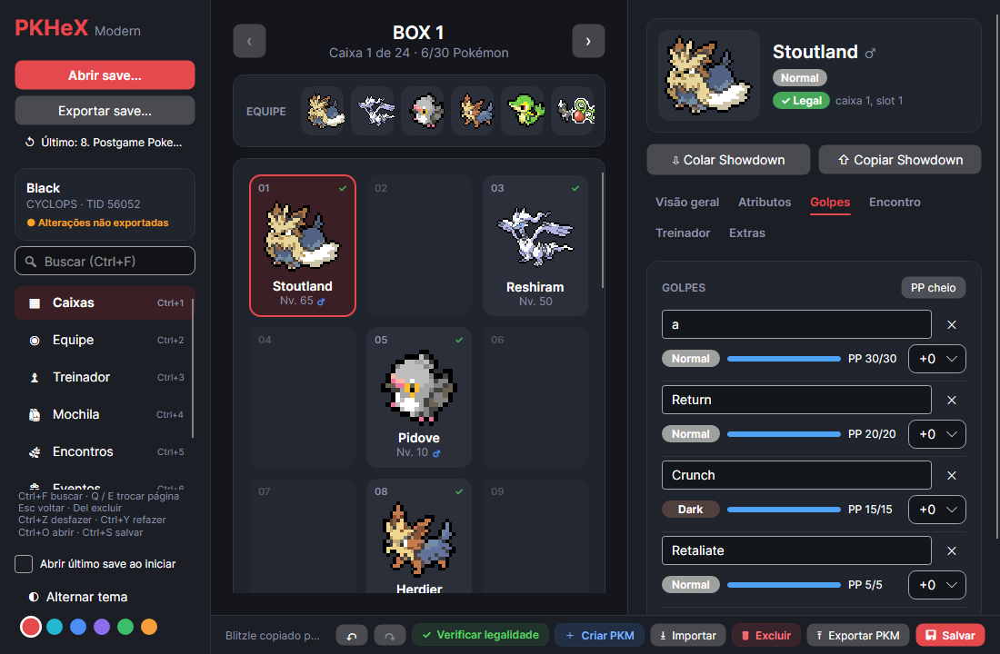

# PKHeX Modern

Interface alternativa para o [PKHeX](https://github.com/kwsch/PKHeX), feita em **Avalonia + Fluent**, com tema escuro e claro.
Ela é construída **por cima** do `PKHeX.Core`, sem alterar os projetos originais. Assim, as atualizações do PKHeX oficial entram por merge sem conflitos.


| Equipe | Janela compacta |
|---|---|
|  |  |

## Como rodar

Requisitos: Windows e [.NET SDK 10](https://dotnet.microsoft.com/download).

```bash
dotnet run --project PKHeX.Modern
dotnet run --project PKHeX.Modern -- "C:\caminho\para\save.sav"   # abre direto um save
```

## Funcionalidades

- **Saves:** abrir pelo botão, arrastando o arquivo para a janela ou pela linha de comando, e exportar.
- **Último save:** atalho na barra lateral para reabrir o último save, mais a opção "Abrir último save ao iniciar".
- **Caixas:** grade responsiva com sprites grandes, nome, nível, posição e ★ para shiny.
- **Equipe:** cartões grandes com nome, apelido e nível, e também uma faixa compacta acima das caixas.
- **Arrastar e soltar:**
  - entre slots de caixa e equipe: move ou troca; com **Ctrl**, copia;
  - parar sobre as setas ‹ › durante o arraste troca de caixa;
  - soltar um arquivo `.pk*` sobre um slot importa o Pokémon.

  As regras do jogo são respeitadas: slots bloqueados, equipe nunca vazia nem só com ovos.
- **Editor de Pokémon:**
  - cabeçalho com tipos coloridos, gênero e selo de legalidade;
  - gráfico hexagonal (radar) dos atributos finais;
  - por atributo: barra do valor base, sliders de IV e EV, total calculado e ▲/▼ da natureza;
  - espécie, nível, natureza, item, habilidade e golpes;
  - colar e copiar no formato **Showdown**;
  - slot vazio abre um Pokémon em branco, já com os dados do treinador.
- **Treinador:** nome, TID/SID, dinheiro e tempo de jogo.
- **Mochila:** bolsos em abas, com item e quantidade dentro dos limites do jogo.
- **Tema:** claro e escuro, e a escolha fica salva.

As preferências ficam em `%APPDATA%\PKHeX.Modern\settings.json`.

## Arquitetura

```
PKHeX.Core / PKHeX.Drawing.*   ← upstream, intocados
        │
Services/CoreAdapter.cs        ← ÚNICO ponto de contato com o Core
Services/SpriteService.cs      ← sprites System.Drawing → Avalonia (com recorte da borda transparente)
Services/AppSettings.cs        ← preferências do usuário
        │
ViewModels/                    ← estado e lógica (Pages.cs = páginas da barra lateral)
Views/ + App.axaml             ← XAML; DataTemplates de cada página ficam em App.axaml
Controls/                      ← controles próprios (StatRadar, conversores)
Theme/Palette.axaml            ← cores (dark/light), incluindo a cor de destaque do Fluent
Theme/Styles.axaml             ← estilos (cards, slots, chips, sliders)
```

## Atualizando com o PKHeX oficial

```bash
git fetch upstream
git merge upstream/master
dotnet build PKHeX.Modern
```

Fora de `PKHeX.Modern/` e `Tools/`, o fork altera apenas uma linha no `PKHeX.slnx` e um bloco no `README.md` da raiz.
Se o build quebrar depois de um merge, o erro estará quase sempre em `Services/CoreAdapter.cs`.

## Adicionando uma tela nova

1. Crie um ViewModel. Para uma página da barra lateral, herde `PageViewModel` (em `ViewModels/Pages.cs`).
2. Registre a página em `AllPages`, no `MainViewModel`.
3. Adicione um `DataTemplate` para ela em `App.axaml`.
4. Se precisar de algo novo do Core, exponha via `CoreAdapter`.

## Capturas de tela automáticas

```bash
dotnet run --project Tools/PKHeX.Modern.Render -- "save.sav" "pasta_saida"
```

Renderiza a interface sem abrir janela (Avalonia headless). É útil para conferir o layout em larguras diferentes.

Veja também: [ROADMAP.md](ROADMAP.md) (pendências) e [CONTINUAR.md](CONTINUAR.md) (contexto para continuar em outro PC).
